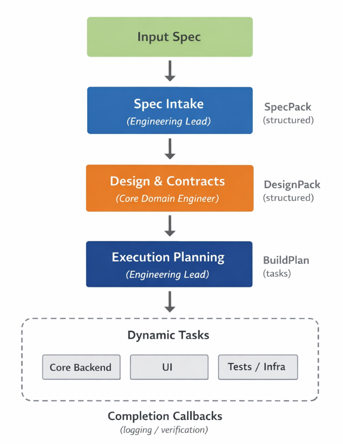

# Ambidence

_A spec-driven, phase-gated multi-agent engineering crew_

> **Note:** This project is currently in an **exploratory / work-in-progress** state. While it is functional and runnable, interfaces and behaviors may change as we refine the multi-agent orchestration patterns.

Ambidence is a spec-driven engineering pipeline orchestrated with CrewAI.

It implements a phase-gated workflow:

- **spec_intake** → `SpecPack`
- **design** → `DesignPack`
- **plan_execution** → `BuildPlan` (max 3 tasks)
- **dynamic implementation tasks** → `FileManifests` → materialized into the generated app



---

## Documentation

- [Master Plan & Future Directions](docs/plan.md)
- [Current Todo List](docs/TODO.md)
- [Proposed Changes Summary](docs/proposed_changes_summary.md)
- [Reliability Checklist](docs/reliability_checklist.md)
- [Outputs](docs/outputs.md)
- [Troubleshooting](docs/troubleshooting.md)

## Setup

- **Python**: >=3.10 <3.14
- **Dependencies**: this project is intended to be run via CrewAI’s project tooling

Put your API key in the project root `.env` (this repo loads it with override semantics to avoid stale keys winning):

- `OPENAI_API_KEY=...`

Install dependencies:

```bash
crewai install
```

Using uv (recommended):

```bash
uv sync
```

This will create a virtual environment and install the dependencies from pyproject.toml. Respect the committed uv.lock for reproducibility.

## Running

### 1) Provide a spec file

This project expects a **separate spec file**. Easiest option:

- create `spec.md` in the project root (this repo already includes one you can edit)

Other options:

- set `SPEC_FILE=/path/to/spec.md` in your environment
- pass `--spec-file /path/to/spec.md` (or `--spec` / `-s`) when running

### 2) Run the crew

From this folder:

```bash
crewai run
```

with uv:

```bash
uv run crewai run
```

This will run the crew using the virtual environment created by uv.

---

Ambidence is an exploration into trust, orchestration, and controlled emergence within agentic systems.
